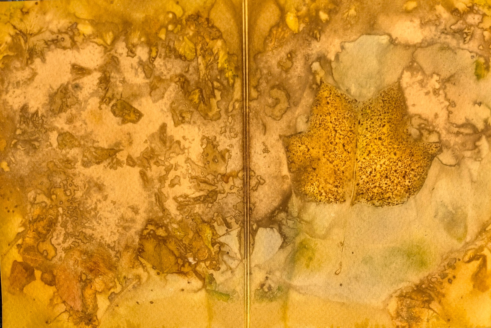

## About

This is an extra test. I wrote something!

Jellybird is the creative identity of Toronto-based artist and educator Sara Wong. She works across a range of mediums — including visual arts, music, sewing, natural dyeing, and small experimental projects — exploring creativity as a place of freedom, play, and discovery. After years shaped by schedules, responsibilities, and the expectations of others, Jellybird emerged as the part of her that creates without purpose or pressure: the part that wanders, experiments, and follows curiosity wherever it leads.

Rooted in slowness and attention, Jellybird’s practice embraces risk-taking, improvisation, and the joy of making for its own sake. Rather than focusing on perfection or convention, she seeks the sense of wonder that comes from trying something new, noticing subtle details, and allowing materials to guide the process. Whether working with plants, fabric, sound, or found objects, Sara approaches each project as an opportunity to explore playfully, without expectation. Through Jellybird, she hopes to invite others into this same spirit of openness, creative rest, and everyday wonder.

## Featured Work

### Alleyway Promenade

#### Botanical treasures from the city’s hidden paths

“Alleyway Promenade” grew out of Sara’s walks through the city’s back lanes and sidewalks, where she gathers fallen leaves and petals and notices small plants growing stubbornly through cracks in the concrete. Occasionally, a neighbour or friend contributes spent flowers from old bouquets or clippings from their gardens, adding a quiet thread of community to her process. Through eco-printing, she transforms these found botanicals using heat, pressure, and time, drawing out pigments and delicate impressions onto paper. Each piece is framed in thrifted or second-hand frames, reflecting her commitment to working with what she discovers along the way.

This exhibition celebrates the subtle beauty found in overlooked spaces: the soft colours drawn from fallen petals, the delicate forms pressed from leaves, and the traces of time held within each impression.

<!-- ## Connect

- **Instagram**: [@jellybird](https://instagram.com)
- **Portfolio**: View my full collection
- **Commission**: Get in touch for custom work -->

---

*Jellybird Art © 2025. All rights reserved.*
